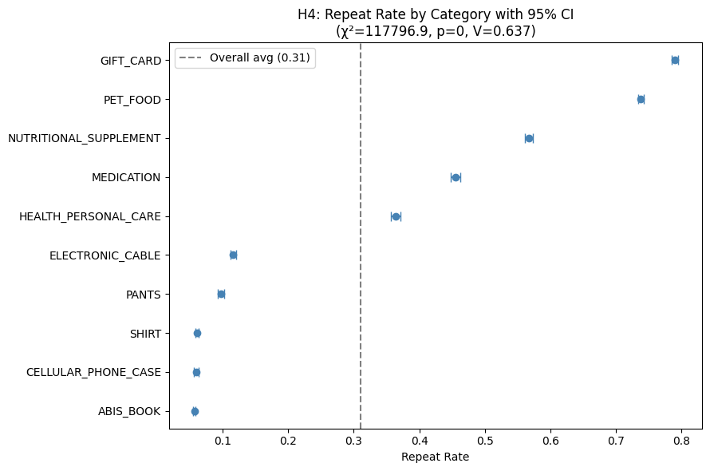
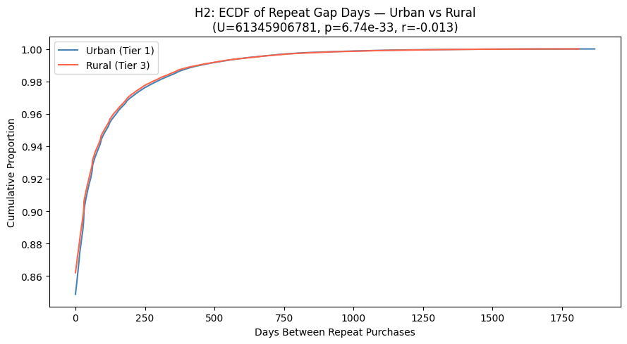
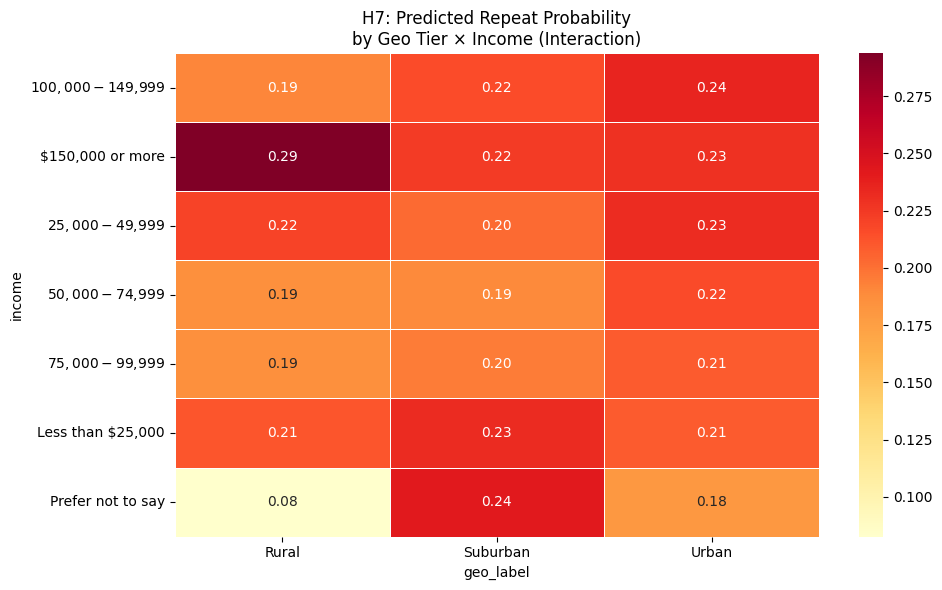

# Statistical Analysis of Geographic E Commerce Disparity
### Do rural buyers experience worse outcomes, or does the data show a smaller story?

 

   

---

## Overview

I started with a simple question. Do rural customers really face worse e commerce outcomes than urban customers, or is that just a common assumption? I did not want to answer that with opinion. I wanted to test it with real transaction data.

The result is more precise than the original belief. Geography matters, but it is not the main driver of repeat buying. Product category and customer behavior explain far more than location alone.

---

## Dataset

I first wanted an Indian dataset, but I could not find one with enough structure for this kind of work. So I used a U S dataset from Harvard Dataverse because it gave me three needed pieces in one place. Transaction records, customer survey responses, and state density data.

The geography is different, but the question is the same. Do urban and rural buyers behave differently in a way that is measurable and meaningful?

> **Note:** This is a U.S. dataset, not Indian. I chose it because it had the right structure for real statistical analysis. The assumption I am testing is universal, so the geography does not change the logic.

**Source:** Harvard Dataverse e commerce dataset

---
## Notebook

Attached to this repository: [Statistical Analysis of Geographic E‑Commerce Disparity Notebook](./Statistical_Analysis_of_E-Commerce_Disparity.ipynb)

The notebook contains the full analysis, including data cleaning, EDA, hypothesis testing, charts, printed outputs, and written interpretation.

---
## What the EDA showed

Visual inspection came before every formal test. That was not a formality. It was the point where the shape of the data started to tell the story.

* Unit price was heavily concentrated below 100 dollars, but a small number of products stretched all the way to 6399 dollars. That kind of spread makes raw price hard to trust, which is exactly why a log transform was needed later. Repeat gap days showed a massive spike near zero and a long right tail. Most repeat purchases happened quickly, but a smaller group came back much later. That shape ruled out simple parametric thinking before the hypothesis testing even began.

* The product view was even more revealing. Repeat buying was not evenly distributed across categories. Some items behaved like routine consumption, while others behaved like one time purchases. Gift cards repeated strongly because they are often reused or repurchased in a predictable way. Books and other low repeat categories behaved differently because they are usually bought less frequently. That difference was far larger than the geographic gap.

* Seasonality also mattered. The monthly pattern was not flat, and the year end period moved differently from the rest of the year. November and December showed the kind of wobble you expect from holiday shopping, where the basket changes and the reason for purchase changes too. That matters because it tells you repeat buying is influenced by timing, not just customer location.

* Geography still showed a signal, but it was a small one. Urban and rural buyers did not separate in a dramatic way. The difference existed, but it was minor compared with product category and time effects. That is the core story of the EDA. The data did not support a strong rural disadvantage, and it pushed the analysis toward behavior and product type instead.

---

## Data preparation

Three source files were merged into one analysis table using left joins so that order records were not lost just because survey data was missing.

Before merging, state codes were standardized so the density table could align correctly with the transaction data. Irrelevant survey columns were removed, labels were cleaned for readability, and the data was reshaped so the analysis could focus on the real predictors of repeat buying.

I did not blindly delete duplicates. Some duplicate looking records are real behavior in e commerce. A customer can buy the same product again on the same day for gifts, bulk purchase, replacement, or recurring use. I flagged duplicates for review instead of pretending every repeat row was a mistake.

---

## Feature engineering

| Feature | Purpose |
|---|---|
| `repeat_same_product_flag` | Marks whether the same customer bought the same product again |
| `repeat_gap_days` | Measures the time between repeat purchases |
| `log_price` | Reduces the impact of extreme price outliers |
| `total_value` | Captures the total order value |
| `price_bin` | Turns continuous price into clean categorical groups |
| `order_year`, `order_month`, `order_weekday` | Supports seasonal analysis |
| `buyer_segment` | Splits orders into Retail, Small Business, and Bulk |
| `outlier_flag` | Flags extreme prices within each buyer segment |

---

## Statistical approach

I used tests that matched the data instead of forcing the data into the wrong test.

**Chi square test** checked whether two categorical variables were related.

**Cramér's V** measured whether that relationship was actually strong or just statistically detectable.

**Mann Whitney U test** compared two skewed numeric groups.

**Rank biserial correlation** showed the practical size of that difference.

**Logistic regression** tested several predictors together and checked whether geography still mattered after controlling for other variables.

The p value alone was not enough. With 1.85 million rows, almost anything can become statistically significant. The effect size is what tells you whether the result matters in practice.

---

## Findings

The results were consistent and blunt. Everything was statistically significant, but not everything was important.

| Hypothesis | Test | p value | Effect Size |
|---|---|---|---|
| H1: Does location affect repeat buying? | Chi square | ~0 | Cramér's V = 0.019 |
| H2: Do rural buyers wait longer to repeat? | Mann Whitney U | ~0 | r = −0.013 |
| H3: Does income affect repeat buying? | Chi square | ~0 | Cramér's V = 0.025 |
| H4: Does category affect repeat buying? | Chi square | ~0 | Cramér's V = 0.637 |
| H5: Does price band affect repeat buying? | Chi square | ~0 | Cramér's V = 0.104 |
| H6: Does purchase month affect repeat buying? | Chi square | ~0 | Cramér's V = 0.041 |
| H7: Do location and income together drive repeat buying? | Logistic Regression | ~0 | Pseudo R² = 0.018, AUC = 0.589 |

Location was detectable, but weak. The urban rural difference was small enough that it should not be treated as the main explanation.

Product category was different. It had a much stronger association with repeat buying, which means what people buy matters far more than where they live.

The combined model stayed weak. Geography, income, price, and quantity together explained only a small part of repeat purchase behavior.

---

## Figures

### H4 - Repeat rate by category

This is the strongest visual in the project. It shows that repeat behavior changes sharply by product type. Gift cards are high repeat. Books are low repeat. That spread is too large to ignore.

### H2 - Urban vs Rural repeat gap days

This comparison shows how similar the two distributions are. The overlap is the point. Geography is real, but the difference is small.

### H7 - Predicted repeat probability by geo tier and income

This heatmap shows that income changes the prediction more than geography does. Even then, the model remains weak overall.

---

## Final takeaway

> The original assumption was that rural buyers would show a strong disadvantage in repeat purchasing. The data did not support that.

> Geography matters, but it is not the main driver. Product category is stronger. Seasonality matters. Repeat timing matters. The evidence is clear enough to say that the story is not about rural versus urban alone.

> The real lesson is the difference between statistical significance and practical significance. A result can be real and still be too small to matter.

---

## Links

**Kaggle notebook**  
[Statistical Validation of Geographic Disparity](https://www.kaggle.com/code/adarshmajhi/statistical-validation-of-geographic-disparity)

**Harvard Dataverse dataset**  
[Amazon Consumer Purchases dataset](https://dataverse.harvard.edu/dataset.xhtml?persistentId=doi:10.7910/DVN/YGLYDY)

---
## Author

### Adarsh Kumar Majhi

Detail-oriented and deeply curious about using statistics to validate real-world observations, patterns, and assumptions.

---

*If you found this project useful or interesting, feel free to ⭐ star the repository.*

